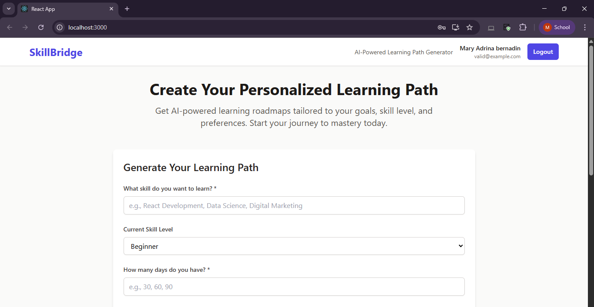
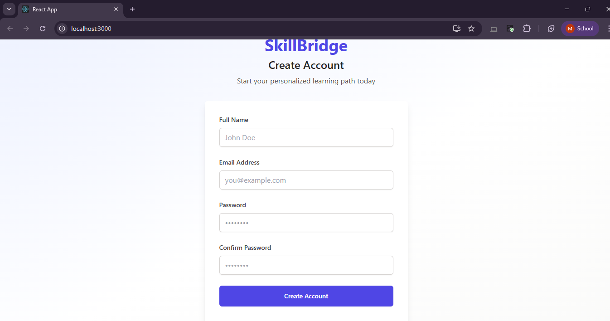
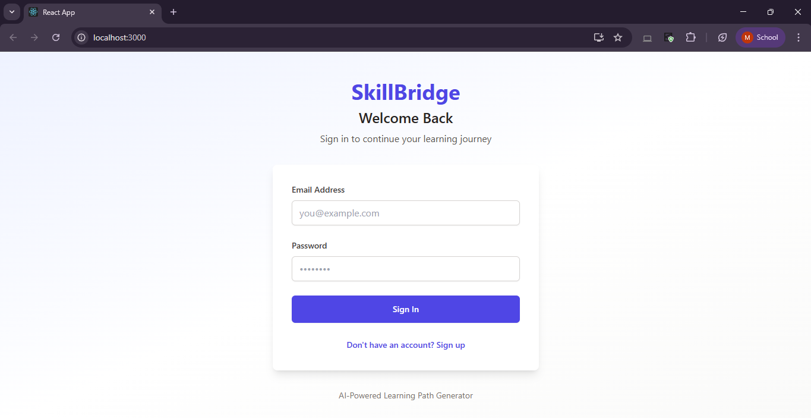
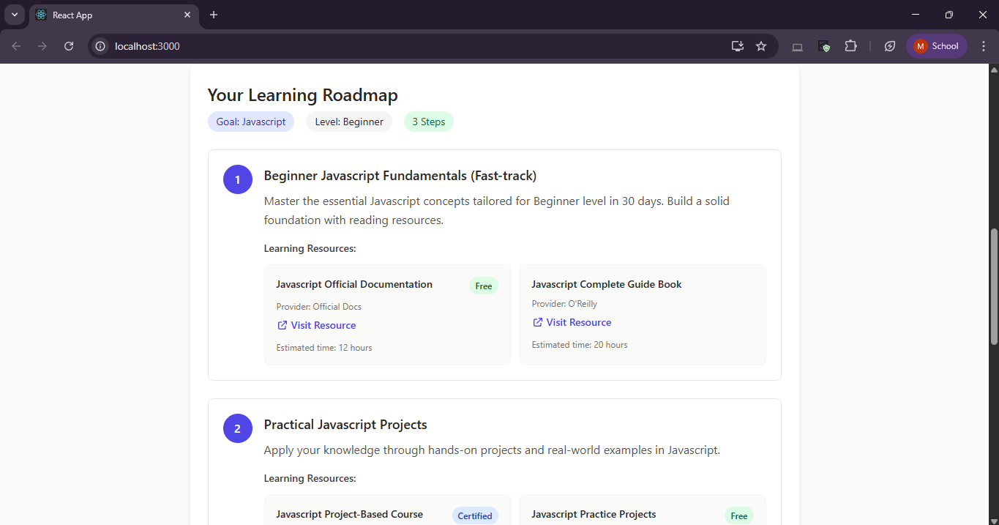
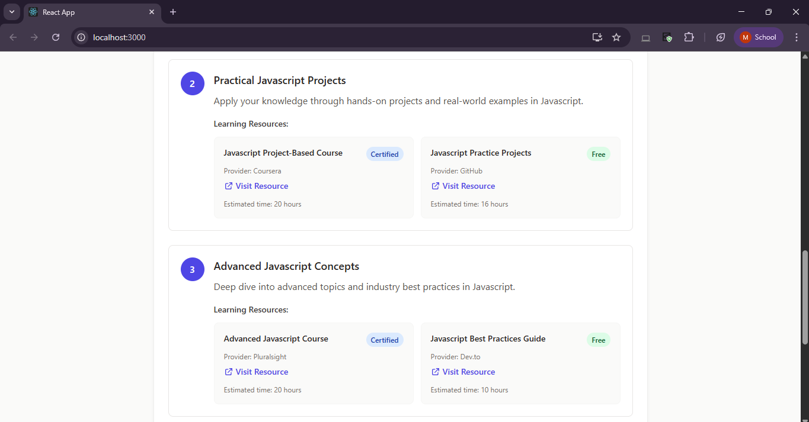
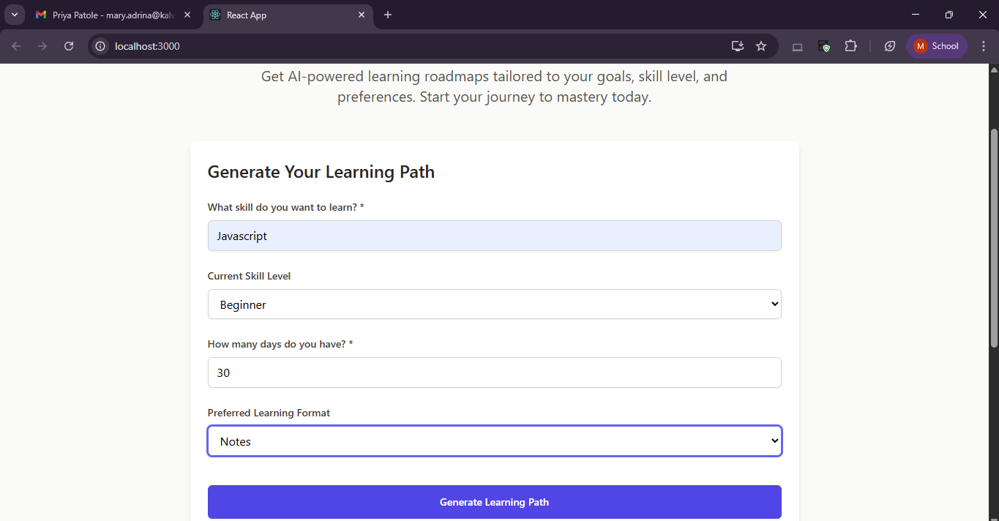

# SkillBridge

SkillBridge welcomes you to a world of personalized learning and intelligent skill-building.  
Our AI-powered web application bridges the gap between ambition and achievement.  
Built with React, Node.js, Express, and MongoDB, SkillBridge provides learners with structured, personalized roadmaps tailored to their goals and progress.

---

## Project Title
**SkillBridge – Personalized Learning Path Generator**

**Tagline:** “Bridging skills to careers with AI-guided learning.”

---

## Team Members
- Sera  
- Adrina  
- Rahul  
- Senorita  
- Alan  

---

## Problem Statement

Learners often struggle to identify the right sequence of courses, projects, and resources to acquire new skills or pursue a career.  
Scattered online materials, inconsistent guidance, and lack of personalized learning paths lead to wasted time and confusion.

**SkillBridge** solves this by generating AI-driven, step-by-step learning roadmaps tailored to each user’s goals, current level, and preferences — ensuring efficient, motivating, and goal-oriented learning.

---

## Core Components

### UI
- Web App built using React.js and Tailwind CSS  
- Clean input forms to capture learning goals, skill levels, and preferences  
- Dynamic dashboard to display AI-generated roadmaps and resources  
- Real-time progress tracking and seamless navigation  

### LLM API
- Uses OpenAI API to generate personalized, structured learning paths  
- Converts user input (like “Web Development” or “AI Fundamentals”) into detailed roadmaps  
- Suggests projects, resources, and timelines to achieve each milestone  

### Tools
- **Database:** MongoDB for user profiles, roadmaps, and progress data  
- **Backend:** Node.js and Express.js for handling routes, logic, and AI integration  
- **Authentication:** JWT-based secure login system  
- **Axios:** For smooth frontend-backend communication  
- **Environment Management:** dotenv for managing API keys and configurations  

---

## Frontend Pages and Screenshots

Below are the main frontend pages of SkillBridge.  
Each section includes a space to insert screenshots that illustrate the functionality.

### 1. Home Page
The landing page introduces the concept of SkillBridge and its main features.  
**Screenshot Placeholder:**  

---

### 2. Signup Page
Allows new users to register by providing their basic details and preferences.  
**Screenshot Placeholder:**  

---

### 3. Login Page
Registered users can log in securely using their email and password to access their dashboard.  
**Screenshot Placeholder:**  

---

### 4. Roadmap Page
Shows the step-by-step roadmap generated by the AI model. Each step includes topics, project ideas, and resources.  
**Screenshot Placeholder:**  

---

### 5. Course Links Page
Contains recommended external learning resources such as YouTube tutorials, documentation, and articles based on the roadmap.  
**Screenshot Placeholder:**  

---

### 8. AI Prompting Page
Users can type what they wish to learn — for example, “Full Stack Development” — and SkillBridge instantly generates a personalized roadmap using the AI service.  
**Screenshot Placeholder:**  

## Backend Explanation

The backend of SkillBridge is built with Node.js and Express.js. It handles user authentication, roadmap generation, progress updates, and AI responses.

### Backend Features
- Secure signup and login using JWT authentication  
- AI-powered roadmap generation using OpenAI API through `aiController.js`  
- `roadmapController.js` for managing user-specific roadmaps (CRUD operations)  
- Stores user profiles, preferences, and progress data in MongoDB  
- RESTful API structure for modular, maintainable code  

### Important Backend Files
- **server.js** – Entry point of the backend server  
- **Controllers**
  - `authController.js` – Handles user authentication  
  - `aiController.js` – Handles AI-generated roadmaps  
  - `roadmapController.js` – Manages roadmap creation, retrieval, and updates  
- **Models**
  - `user.js` – Stores user schema  
  - `roadmap.js` – Stores AI-generated roadmap structure  
  - `resourceLibrary.js` – Stores course and learning resource data  
- **Middleware**
  - `authMiddleware.js` – Protects routes with authentication  

---

## Main API Endpoints

- `POST /api/users/register` – Create new user account  
- `POST /api/users/login` – Authenticate and return JWT token  
- `POST /api/roadmap/generate` – Generate AI-powered learning path  
- `GET /api/roadmap` – Retrieve user’s saved roadmap  
- `PUT /api/roadmap/update` – Update roadmap or progress  
- `GET /api/progress` – Fetch user progress status  

---

## Tech Stack

### Frontend
- React.js  
- Tailwind CSS  
- Axios  
- React Router DOM  

### Backend
- Node.js  
- Express.js  
- MongoDB Atlas  
- JWT and bcrypt  

### AI Integration
- OpenAI API  

### Environment
- dotenv  
- Git and GitHub for version control  

---

## Deployment

SkillBridge is deployed using modern hosting services to ensure smooth performance across both frontend and backend.

### Frontend Deployment
Deployed on **Netlify** for fast, scalable, and secure hosting.  
**Frontend Link:**  

### Backend Deployment
Deployed on **Render**  for backend hosting and API endpoint accessibility.  
**Backend Link:**  

---

## How It Works

1. User signs up or logs in to the SkillBridge platform.  
2. The user enters their learning or career goal.  
3. The AI generates a structured, step-by-step roadmap.  
4. The roadmap includes stages, projects, and course resources.  
5. The user can update progress and revisit previous milestones anytime.  

---

## Deployment Workflow

1. Build the frontend using `npm run build`.  
2. Deploy the build directory to **Netlify**.  
3. Deploy the backend server using **Render**.  
4. Connect both with API URLs defined in `.env` file.  
5. Test routes, authentication, and AI generation functionality.  

---

## Conclusion

SkillBridge empowers learners to achieve their goals through structured, AI-guided learning paths.  
With personalized roadmaps, resource recommendations, and progress tracking, SkillBridge transforms unorganized learning into an efficient and inspiring experience.

## Video Link:
https://drive.google.com/file/d/1ZzM8aPuy8pKmFmOD1K_95VQTNx96qtxI/view?usp=sharing

---# skillbridgeproai
